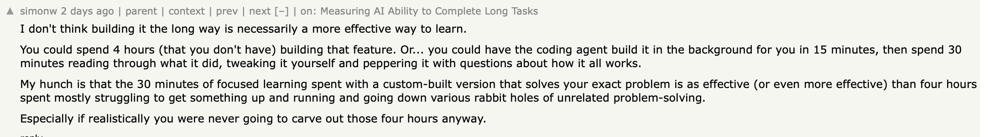
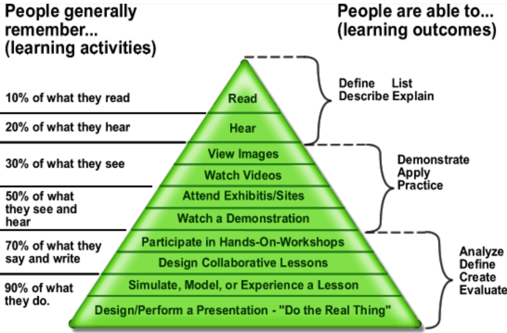

As another year drew to a close, I found myself scrambling to spend my learning budget before it expired. I stumbled upon `Codecrafters.io`, a cozy site in the same spirit as Advent of Code. It challenges you to implement a subset of popular services like SQLite, Redis, or Kafka. The goal: learn new things or refresh old knowledge. The idea is simple, you fulfill a set of incremental tasks, each with a sparse description, and that's it. The objective is to pass the tests; nobody is going to check how your code looks or ask how you did it.

I started with the `SQLite` track; I work on building a database, so it looked like a natural choice. Everything was going well until I hit the first wall,and immediately thought, “I could just let an LLM handle this.” Why bother doing it by hand? Am I a prehistoric fella?

## Why struggle learning a new thing in 2026?

Last year, the number of people who believed LLMs were useless for coding tasks was decimated. Right now, we could divide ourselves into two groups: those who think LLMs are just a performance tool, and those who believe AI is going to replace us in the near future.

So, what’s the point of struggling to implement my own varint or B-tree, or skimming through the SQLite spec, when I can just type what I want and go watch a TV show? And an even more interesting question: why keep learning something new when the LLM already knows everything?

There are two ways to answer these questions. The first is that learning is a skill we need to hone, or it gets rusty. The second is that we don’t know what the future will look like; maybe AGI will arrive this year and 99% of the working population will be laid off, or maybe not. What I know for sure is that, as always, the fittest have the best chance to survive. Being able to learn new things and adapt to change is, and will remain, a differentiator.

So how do we actually learn in an era of AI shortcuts? By embracing struggle rather than avoiding it.

## Fall, Learn, Stand Stronger

Once we have decided that we don’t want to give up on learning new things, whether for fun or profit, we should ask ourselves what the best way to achieve it is. LLM advocates like Simon Willison believe that AI can be a more effective way to learn than the old-fashioned method of coding everything by hand:

Simon raises a fair point, yet his approach overlooks fundamental principles of how we actually learn. His method prioritizes speed over depth—a trade-off that costs us more than we realize.
The danger of the “15-minute review” is the illusion of competence. When an LLM explains its code, it feels clear because the AI has already done the heavy lifting of synthesis. But reading a solution is a passive act, not an active one.

The classic learning pyramid shows why “doing the real thing” is the foundation of learning, while reading solutions sits near the top. Learning sticks through repetition and practice: just like multiplication only becomes second nature after thousands of exercises, coding concepts become real only when we build them ourselves. Trying to shortcut this process with an LLM risks creating the illusion of competence rather than understanding. This is so true that it also applies to physical abilities, like learning to do a handstand.

This doesn't mean LLMs have no place in learning, quite the opposite. They're powerful companions when used wisely: to explain concepts you're struggling with, to suggest approaches when you're stuck, or to review your completed work. But they should never replace the struggle that builds true understanding.

Am I a prehistoric fella? Maybe. But I want to be the one who knows how to start a fire.
***Keep learning***.
